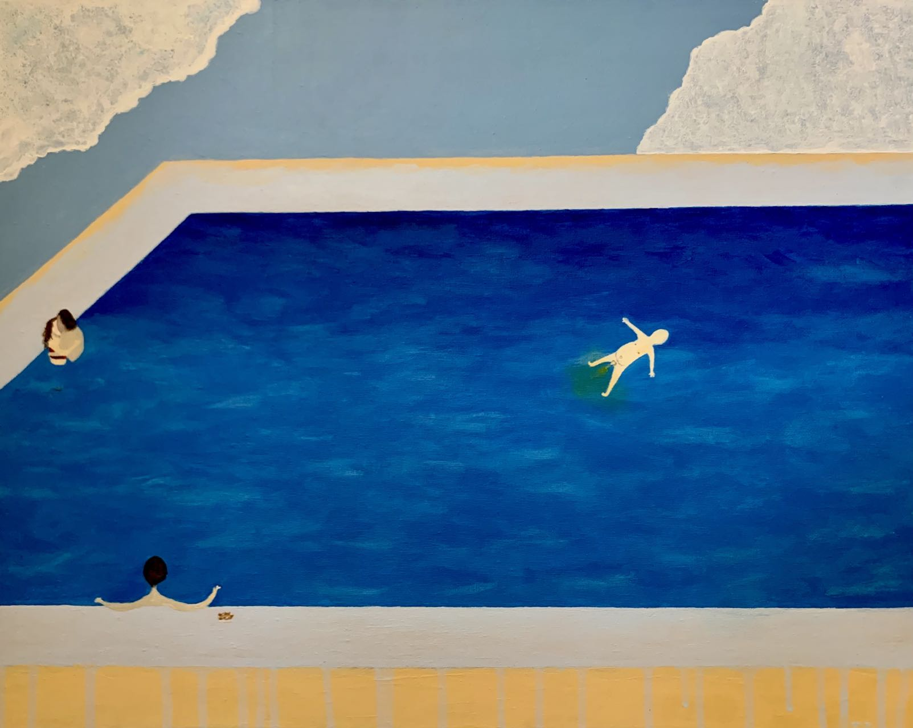



Workout:
======
<video width="560" height="315" controls>
  <source src="../my_life/workout.mp4" type="video/mp4">
</video>

Fishing:
======

Painting:
======

Basketball:
======

Adventure:
======
<video width="560" height="315" controls>
  <source src="../my_life/advanture_1.mp4" type="video/mp4">
</video>

Travel:
======
<video width="560" height="315" controls>
  <source src="../my_life/travel_1.mp4" type="video/mp4">
</video>

Cooking:
======
